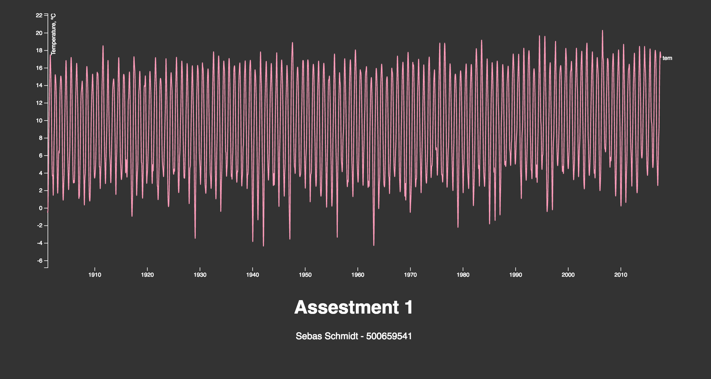

#### Assestment 1
 #### A simple representation of the homogenised monthly temperature time series of De Bilt (1901-present). Cleaned from knmi.nl.

  >Files in this project:
  > * index.csv
  > * style.css
  > * index.html
  > * preview.png
  > * index.js

 ##### Background
This is the first assestment for the front end 3 course. Goal was to represent given data into an visualisation and explaining the code with comments.

 ##### About the chart
The chart visualizes the monthly temprature of De Bilt in the Netherlands.
The chart itself is one from https://bl.ocks.org/mbostock/3884955 made by Mike Bostok. I have chosen this chart because it already represented likewise data. The original chart displayed data from three cities.

 ##### Changes
The changes I made to the document where:
* seperating files; index.css, style.css, index.js
* maked changes to variables in the index.js file
* var cities to temp because there is 1 chart displaying the temprature
* var city to chart because there is 1 chart in this case and not 3 as in original chart
* changing the style of the chart
* changing the original tsv link to a csv link

 ##### Features
 * [d3-array](https://github.com/d3/d3-array#api-reference)
 * [d3-axis](https://github.com/d3/d3-axis#api-reference )
 * [d3-request](https://github.com/d3/d3-request#api-reference)
 * [d3-scale](https://github.com/d3/d3-scale#api-reference)
 * [d3-selection](https://github.com/d3/d3-selection#api-reference)

 ##### License
 GPL-3.0 © Sebas Schmidt
